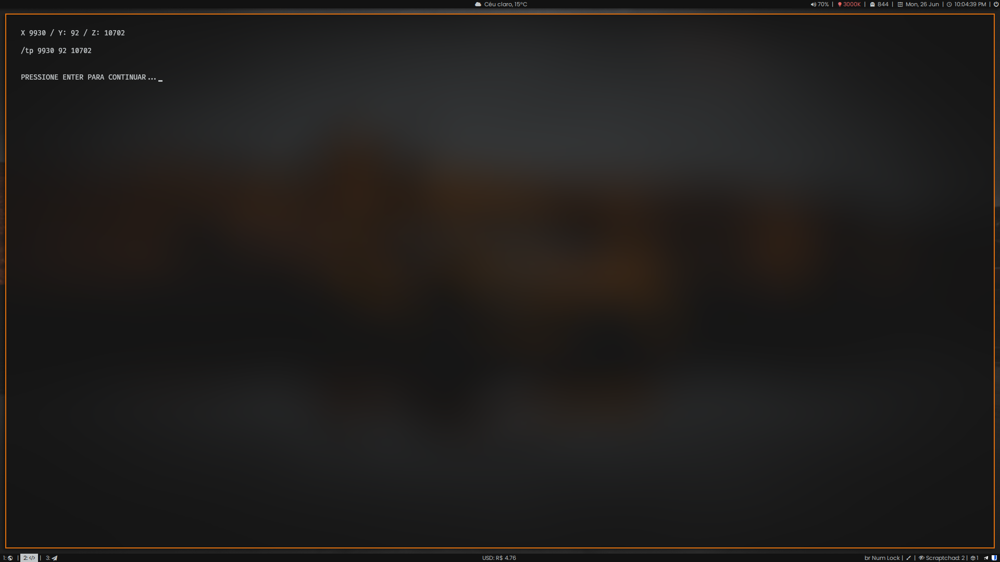

# MineCoord

Esse script cria coordenadas aleatórias para o minecraft.

E gerencia coordenadas salvas

## ATENÇÃO:

- Antes de executa-lo, leia o script.
- Fique a vontade para editar o script ao seu gosto/uso.

## Download/Execução:

```bash
wget -c "https://github.com/frannks/minecoord/raw/main/minecoord.sh"
chmod +x minecoord.sh && ./minecoord.sh
```
### Demonstração:



## Contatos:

[Telegram](https://t.me/FranklinTech)

[Email](mailto:fraank@riseup.net)
